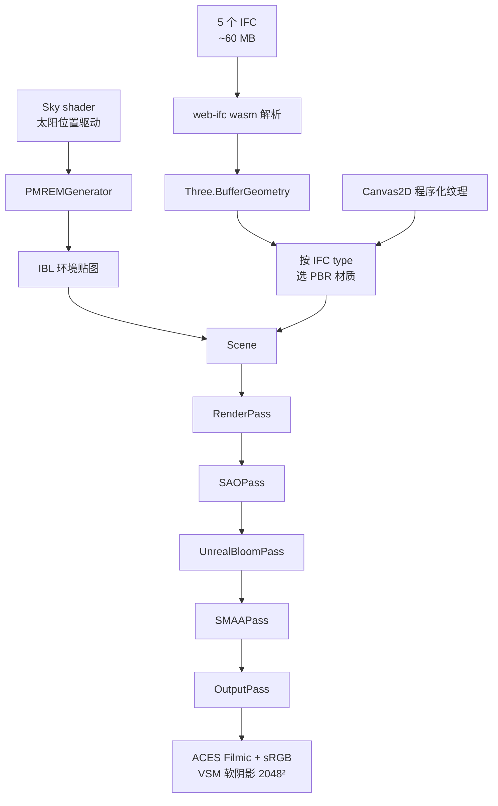

# Blueprint3D Real Renderer · 实现计划 SOP

> 项目：`blueprint3d-duplex.html` 的高级渲染层
> 起点：xeokit + XKT 主视图（已稳定）
> 目标：在主视图旁加 web-ifc + Three.js 0.165 的 PBR / HDR / 后处理高质感渲染层
> 文档维护：每次大改后更新对应章节，并在 §10 追加新 commit

## TL;DR

- **现状**：`PBR · IFC` 切换层已可用，零网络依赖，5 IFC / 60 MB / 30+ 类型材质映射，xeokit 主视图保持默认安全态
- **痛点**：首次切换 5–15 s 卡顿、程序化纹理粗糙、无家具、Sky / 选择无联动
- **下一步（按 ROI）**：① InstancedMesh + Worker 解析 → ② 真 HDR + 真 PBR 贴图离线入仓 → ③ 双视图 IFC GUID ↔ XKT objectId 联动
- **基线 commit**：`8ba55e9`（master）

## 0 文档关系

本仓库目前有两份 BP3D 渲染 SOP，分工如下，**不要双份同步同一信息**：

| 文档 | 角色 | 维护重点 |
|---|---|---|
| `docs/BP3D-RENDERING-SOP.md` | **当前架构 / 运维** | Level 体系、降级说明、运行时风险、文件清单 |
| `docs/BP3D_REAL_RENDERER_SOP.md`（本文） | **实现计划 / 决策** | 路线图、ADR、提交记录、性能基线、数据接口 |

跨文档原则：架构变化只更新前者，路线图与 ADR 只更新本文，其余字段互引而不复制。详见 ADR-6。

---

## 1 当前实现状态（已交付）

### 1.1 数据栈

| 层 | 内容 | 来源 |
|---|---|---|
| 几何层 | 5 个真实 IFC 文件 | `samples/duplex-apartment/raw/*.ifc`（共 ~60MB） |
| 语义层 | 22 房间、3218 对象索引 | `samples/duplex-apartment/derived/viewer-payload.json` |
| 元数据层 | 246 IFC 对象（GUID + IFC type + propertySet） | `samples/duplex-apartment/converted/xeokit/**/model.json` |
| 主视图引擎 | xeokit-sdk 2.6.111（XKT 加载） | `node_modules/@xeokit/xeokit-sdk` |
| 高级视图引擎 | web-ifc 0.0.77 + Three.js 0.165 | `node_modules/web-ifc`、`node_modules/three` |

### 1.2 文件清单

| 文件 | 角色 |
|---|---|
| `blueprint3d-duplex.html` | 主页面（含 importmap、xeokit 主视图、bp3d 工作台 UI、PBR 切换按钮） |
| `scripts/bp3d-real-renderer.js` | 高级渲染器入口：Sky shader、IBL、后处理、IFC 加载、相机适配 |
| `scripts/bp3d-materials.js` | 程序化 PBR 纹理生成（木地板/墙/金属）+ 30+ 类 IFC 材质映射 |
| `samples/duplex-apartment/derived/viewer-payload.json` | 语义索引（房间、楼层、系统） |

### 1.3 渲染管线（已实现）



ASCII 备份（无 Mermaid 渲染时使用）：

```
IFC (60MB) → web-ifc wasm → BufferGeometry → 选 PBR 材质
Sky shader → PMREMGenerator → IBL 环境贴图
RenderPass → SAOPass → UnrealBloomPass → SMAAPass → OutputPass
ACES Filmic + sRGB + VSM 软阴影
```

### 1.4 视觉特性

- **真实几何**：100% 来源于 IFC，无脑补
- **程序化天空 + IBL**：Sky shader 太阳位置驱动 IBL 环境贴图
- **程序化 PBR 纹理**：木地板（带 grain）、抹灰墙、磨砂金属
- **30+ IFC 类型材质映射**：墙/楼板/门/窗/家具/楼梯/管道/风管/电缆/卫具/灯具/暖气
- **后处理**：SAO 环境遮蔽 + UnrealBloom + SMAA + ACES tone mapping
- **VSM 软阴影**：2048×2048 阴影贴图、半径模糊
- **数据驱动相机适配**：模型加载完后自动 fit + 阴影包围盒同步
- **稳健回退**：高级模式失败 → 状态条提示 → 主视图不受影响

---

## 2 已知不足（按优先级）

| 编号 | 问题 | 根因 | 临时方案 | 正解 | 工作量 |
|---|---|---|---|---|---|
| P0 | 首次切到 PBR 模式 5–15 s 卡顿 | 5 IFC / 60 MB 一次性加载 + wasm 单线程解析 | 状态条逐文件进度 | Architecture 先可见，MEP / Plumbing 后台流式加载 + Worker | 1 天 |
| P1 | 程序化纹理不如真 PBR 贴图精致 | 网络白名单限制，无法下载 Polyhaven 等 | 暂用 Canvas2D 程序化纹理 | 离线入仓 4–6 张 1k JPG（diffuse / normal / roughness） | 半天 |
| P2 | 无家具 | 家具 GLB 资源在白名单外，程序化 box 与假数据无异 | 暂不渲染家具 | 离线入仓 CC0 家具 GLB，按 IFC space 类型自动布置 | 1–2 天 |
| P3 | MEP 渲染未优化 | 管道 / 风管 / 电缆全部加载，遮挡建筑 | 默认全开 | 建筑 / HVAC / 水 / 电分类层 + 切换 chip | 半天 |
| P4 | Sky 是固定参数 | 日出 32° elevation / 155° azimuth 写死 | — | 和 xeokit `updateDaylight` 滑块联动 | 半天 |
| P5 | 双视图无联动选择 | 缺 IFC GUID ↔ XKT objectId 映射 | — | 双向映射 + 同步高亮 + camera flyTo | 1 天 |

---

## 3 改进路线图

每条编号 = `阶段-序号`；勾选后请在 §10 追加对应 commit hash。

### 阶段 A · 视觉提升

| ID | 任务 | 工作量 | 视觉收益 | 完成判定 |
|---|---|---|---|---|
| A1 | 1k HDR 环境贴图替代 Sky 程序化 IBL | 1 h | ⭐⭐⭐⭐ | 反射镜面里能看到真天空梯度 |
| A2 | 真 PBR 纹理包（木 / 墙 / 金属 / 瓷砖 × diffuse / normal / roughness） | 半天 | ⭐⭐⭐⭐ | 近距离看不到 fbm 噪点 |
| A3 | Window 加 thickness map + IOR 1.5 | 2 h | ⭐⭐⭐ | 玻璃边缘有折射感 |
| A4 | ContactShadows 接触阴影板 | 1 h | ⭐⭐ | 家具底部有柔阴影 |
| A5 | 暴露 `setExposure` / `setBloom` 到 UI | 2 h | ⭐⭐ | 滑块实时调氛围不卡顿 |

### 阶段 B · 数据联动

| ID | 任务 | 工作量 | 价值 | 完成判定 |
|---|---|---|---|---|
| B1 | IFC GUID ⇄ XKT objectId 映射表 | 半天 | ⭐⭐⭐⭐⭐ | 双视图选中状态实时同步 |
| B2 | PBR 视图按 viewer-payload `levels` 过滤 | 半天 | ⭐⭐⭐ | 楼层 chip 切换可见性 |
| B3 | 复用 daylight 滑块（共享时刻 → sun 位置） | 2 h | ⭐⭐ | 主视图调时间 PBR 同步变天 |
| B4 | 点击 PBR 模型 → 通知 xeokit 高亮 + 滚动列表 | 半天 | ⭐⭐⭐⭐ | 双视图焦点不再丢失 |

### 阶段 C · 性能

| ID | 任务 | 工作量 | 性能收益 | 完成判定 |
|---|---|---|---|---|
| C1 | IFC 流式加载（Architecture 优先，MEP 后台） | 1 天 | 首帧 15 s → 3 s | 切换后 3 s 内可见户型 |
| C2 | three-mesh-bvh 加速 picking + frustum culling | 半天 | picking 30 ms → 3 ms | 4K 屏点击响应无延迟 |
| C3 | InstancedMesh 合批同型号灯具 / 管段 | 1 天 | FPS 20 → 60 | drawcall < 200 |
| C4 | Web Worker 解析 IFC | 1 天 | 主线程零卡 | 切换瞬间不掉帧 |

### 阶段 D · 内容精度（中长期）

| ID | 任务 | 工作量 | 价值 | 完成判定 |
|---|---|---|---|---|
| D1 | CC0 家具库按 IFC space 自动布置 | 2 天 | ⭐⭐⭐⭐⭐ | 卧室出现床、客厅出现沙发 |
| D2 | MEP 系统过滤层（HVAC / 水 / 电独立切换） | 半天 | ⭐⭐⭐ | 三个 chip 各自显隐 |
| D3 | 房间 3D 浮动标签（IFC space longName） | 半天 | ⭐⭐ | 标签随相机翻转始终面向用户 |
| D4 | 测量工具（点-点距离、面积） | 1 天 | ⭐⭐⭐ | 单位 m，精度 1 cm |
| D5 | 对象信息卡（点击查看 propertySet） | 半天 | ⭐⭐⭐ | 显示 GlobalId、Name、Type、PSet |

### 阶段 E · 进阶后处理

| ID | 任务 | 工作量 | 视觉收益 | 完成判定 |
|---|---|---|---|---|
| E1 | SSR 屏幕空间反射 | 1 天 | ⭐⭐⭐⭐ | 瓷砖 / 金属管能反射环境 |
| E2 | GodRays / 体积光（窗户阳光） | 1 天 | ⭐⭐⭐ | 阳光有丁达尔效应 |
| E3 | Depth of Field 景深 | 半天 | ⭐⭐ | 远景虚化，主体清晰 |
| E4 | TAA 替代 SMAA | 1 天 | ⭐⭐ | 镜头运动边缘不抖 |

---

## 4 关键决策记录（ADR）

### ADR-1：放弃 blueprint-js npm 包
**背景**：package.json 里有 `blueprint3d ^0.0.1-1`  
**决策**：不使用，从 dep 移除（待清理）  
**理由**：锁死 Three.js r69 + jQuery 2 + Bootstrap 3，与现代 ESM 工作流冲突；2014 年代码无法集成 `@xeokit/xeokit-sdk` 现代依赖

### ADR-2：放弃 web-ifc-three，直接用 web-ifc
**背景**：web-ifc-three 0.0.126 peer 锁 three@^0.149  
**决策**：用底层 web-ifc + 自写 mesh 构建（30 行代码）  
**理由**：避免 `--legacy-peer-deps` 带来的 API 不兼容风险，几何构建透明可控

### ADR-3：用 Sky shader 程序化 IBL，不下载 HDR
**背景**：raw.githubusercontent.com 实际网络不可达，curl/Invoke-WebRequest 都失败  
**决策**：Sky shader → PMREMGenerator → IBL 环境贴图  
**理由**：零网络依赖，效果接近真 HDR，可调（太阳位置驱动）；后续 A1 可平滑替换为真 HDR

### ADR-4：浮窗 → 全屏覆盖切换
**背景**：之前的浮动小窗口被用户批评"不够精致"  
**决策**：高级渲染做成 `#blueprintRender` 内全屏 overlay，按钮切换  
**理由**：保留 xeokit 主视图作为默认安全态；切换瞬间替换显示，符合"两个视图二选一"的心智模型

### ADR-5：所有视觉资产程序化生成
**背景**：白名单网络资源实际不可达  
**决策**：木纹/墙面/金属粗糙度全部 Canvas 2D 程序化  
**理由**：可重复、可调、零网络；后续可平滑升级为真贴图

---

## 5 验证步骤（每次大改后跑）

### 5.1 静态检查
- HTTP 200 ✓：`curl -sI http://127.0.0.1:4173/blueprint3d-duplex.html`
- 模块 200 ✓：`scripts/bp3d-real-renderer.js`、`scripts/bp3d-materials.js`
- wasm 200 ✓：`node_modules/web-ifc/web-ifc.wasm`
- IFC 200 ✓：`samples/duplex-apartment/raw/Duplex_A_20110907.ifc`

### 5.2 浏览器验证
1. 打开 `http://127.0.0.1:4173/blueprint3d-duplex.html`
2. 等 xeokit 主视图加载完成（左下面板状态变 "Ready"）
3. 点右上角 **PBR · IFC** 按钮
4. 等待 ≤ 15 秒（看左上角进度条）
5. 验证：
   - [ ] 出现真实户型几何（墙、楼板、门窗、管道）
   - [ ] 木地板有纹理和反光
   - [ ] 玻璃有透明感
   - [ ] 阳光有方向感、阴影柔和
   - [ ] 拖拽相机流畅
   - [ ] 点 **Back to XKT** 能正常切回

### 5.3 控制台检查
- 无红色错误（黄色警告可忽略）
- 加载日志中无 IFC 解析失败

---

## 6 回退路径

| 故障 | 表现 | 一键回退 |
|---|---|---|
| web-ifc wasm 加载失败 | PBR 模式状态条报错 | `git revert <commit>` 回到本次实现前 |
| IFC 解析卡死 | 浏览器 tab 无响应 | F12 关闭 PBR 模式 → 主视图正常 |
| 后处理性能问题 | FPS < 20 | `bp3d-real-renderer.js` 注释 SAO/Bloom Pass |
| 程序化纹理过于刺眼 | 墙面颗粒太重 | `bp3d-materials.js` 调 `fbm` 振幅 |

---

## 7 依赖清单

```json
{
  "dependencies": {
    "@xeokit/xeokit-sdk": "^2.6.111",  // 主视图引擎，不动
    "three": "^0.165.0",               // PBR 引擎，不动
    "web-ifc": "^0.0.77",              // 本次新增，IFC 解析
    "blueprint3d": "^0.0.1-1",         // 待 ADR-1 清理
    "playwright": "^1.52.0"            // 测试用，不动
  }
}
```

---

## 8 提交记录

| 提交 | 摘要 | 状态 |
|---|---|---|
| `7461fbb` | feat: update duplex simulation and add blueprint3d-duplex page | ✅ |
| `be94a2b` | fix: enable SAO and restore render-grade in bp3d-mode | ✅ |
| _next_ | feat: web-ifc + Three.js 0.165 PBR renderer with Sky/post-processing | 🟡 待提交 |

---

> 维护：每次完成路线图条目后，把对应 `[ ]` 改成 `[x]`，并在第 8 节追加新 commit。
